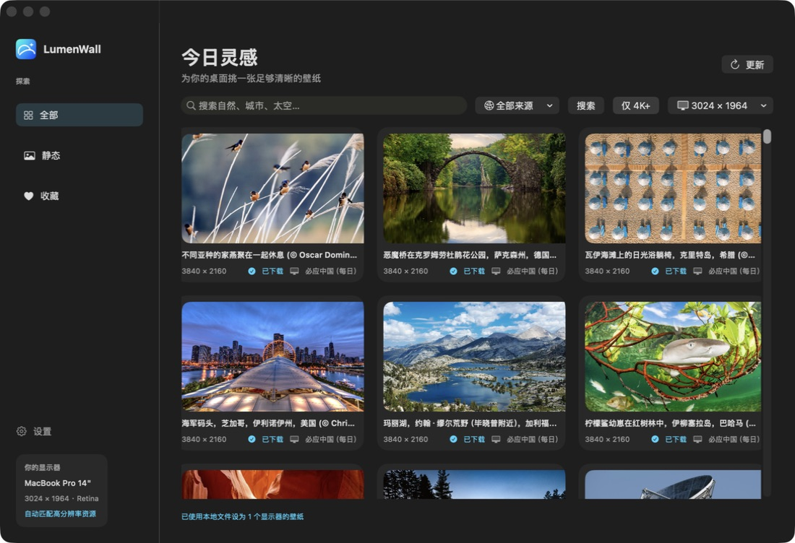
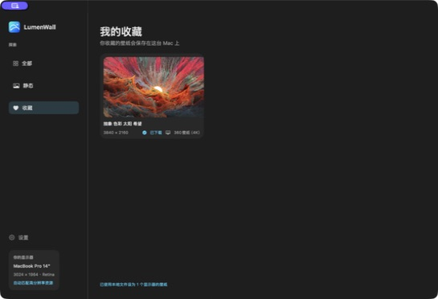

# LumenWall

一款原生 SwiftUI macOS 静态壁纸应用。LumenWall 聚合多个公开图片来源，优先展示适合高分辨率显示器的图片，并支持下载、收藏、直接设为桌面壁纸及定时随机更换。

> 当前要求 macOS 14 或更高版本，推荐在 14 英寸 MacBook Pro（3024 × 1964 Retina）或 4K 显示器上使用。

## 界面预览

| 浏览与搜索 | 我的收藏 |
| --- | --- |
|  |  |

## 现有功能

- 多来源搜索：可在“全部来源”、必应中国每日壁纸、360 壁纸（4K）、Wallhaven、Wikimedia Commons 之间切换，也可聚合搜索。
- 高分辨率优先：支持 4K+ 筛选，并提供 MacBook Pro 14 英寸与 4K 显示器的分辨率匹配选项。
- 持续加载与缓存：搜索结果支持触底继续加载；已请求的图片资料会缓存在本机，下次优先展示缓存并请求最新内容。
- 预览与版权信息：查看大图、分辨率、作者、许可证与原始来源页。
- 收藏：在预览页点击爱心收藏；左侧“收藏”页面仅展示已收藏的壁纸。收藏资料保存在本机，不会因搜索缓存更新而丢失。
- 下载与设为壁纸：可选择默认下载目录；已下载的图片可直接复用。左侧“已下载”页集中展示本地壁纸，可将不需要的图片移入废纸篓。支持设置主显示器或所有已连接显示器，并可在切换 macOS 虚拟桌面（Spaces）时重新应用当前壁纸。
- 随机定时更换：可多选来源，按 30 分钟、1 小时、2 小时或自定义 30–1440 分钟随机下载并设置壁纸。系统唤醒或应用重新活跃时会补做错过的任务。
- 菜单栏快捷操作：关闭主窗口后应用仍驻留在菜单栏，可打开主窗口、立即随机换图、收藏当前由 LumenWall 设置的壁纸、调整随机来源/间隔或退出。
- 本地化与外观：支持简体中文、English，以及跟随系统、浅色、深色三种外观方案。

## 数据来源

| 来源 | 适用场景 | 说明 |
| --- | --- | --- |
| 必应中国 | 每日风景 | 提供每日壁纸与历史归档加载。 |
| 360 壁纸（4K） | 中文关键词与 4K 分类 | 针对常见中文分类提供高清图片。 |
| Wallhaven | 英文标签、广泛题材 | 使用公开 SFW 搜索接口。 |
| Wikimedia Commons | 公共领域与开放许可作品 | 展示创作者、许可证和来源页。 |

各来源的内容和许可归其权利人所有。使用或再发布图片前，请以应用内显示的来源页与许可证为准。

## 本地运行

### 前置条件

- macOS 14+
- Xcode（包含完整 Command Line Tools）
- Swift 6（由 Xcode 提供）

### 构建并启动

```bash
git clone git@github.com:vwin/Mac-wallpaper.git
cd Mac-wallpaper

DEVELOPER_DIR=/Applications/Xcode.app/Contents/Developer swift build
open .build/LumenWall.app
```

请打开 `.build/LumenWall.app`，而非直接运行裸可执行文件；这样 macOS 的输入法、菜单栏和系统服务能够正常工作。

如需直接通过 SwiftPM 运行，也可使用：

```bash
DEVELOPER_DIR=/Applications/Xcode.app/Contents/Developer swift run LumenWall
```

### 运行测试

```bash
DEVELOPER_DIR=/Applications/Xcode.app/Contents/Developer \
CLANG_MODULE_CACHE_PATH="$PWD/.build/clang-module-cache" \
SWIFTPM_MODULECACHE_OVERRIDE="$PWD/.build/swift-module-cache" \
swift test
```

## 打包为安装包（PKG）

每个正式安装包会作为 GitHub Release 附件发布。以下示例从当前构建生成一个本地可安装的 PKG；请先在 `AppBundle/Info.plist` 中更新版本号和构建号。

```bash
DEVELOPER_DIR=/Applications/Xcode.app/Contents/Developer swift build

VERSION=0.1.22
STAGING=dist/InstallerRoot
APP="$STAGING/Applications/LumenWall.app"

mkdir -p "$STAGING/Applications"
ditto --noextattr --norsrc .build/LumenWall.app "$APP"
cp AppBundle/Info.plist "$APP/Contents/Info.plist"

# 本地测试签名；正式发布请改用 Developer ID Application 证书。
codesign --force --deep --sign - "$APP"

pkgbuild \
  --root "$STAGING" \
  --component-plist AppBundle/InstallerComponents.plist \
  --identifier com.lumenwall.installer \
  --version "$VERSION" \
  --install-location / \
  --ownership recommended \
  "dist/LumenWall-$VERSION-installer.pkg"

codesign --verify --deep --strict --verbose=2 "$APP"
```

安装后应用位于 `/Applications/LumenWall.app`。

该流程采用临时本地签名，只适合个人测试。若要向外发布，请使用 Apple Developer 证书进行签名和公证；若要发布到 Mac App Store，还需要 App Sandbox、隐私说明、App Store Connect 元数据及审核准备。

## 使用提示与限制

- 定时随机更换要求 LumenWall 保持运行（关闭窗口不等于退出）。完全退出应用后，macOS 不会替应用后台唤醒任务。
- macOS 的公开 API 不支持为每一个 Space 永久保存不同壁纸。启用“同步所有虚拟桌面”后，LumenWall 会在切换 Space 时将当前选定的图片重新应用。
- “同步所有已连接显示器”会将同一张图片设到所有物理显示器；关闭此选项时只设置主显示器。
- 网络来源可能临时不可用。缓存可以用于浏览已经请求过的结果，但首次请求、下载原图和刷新最新内容仍需要网络。

## 项目结构

```text
Sources/LumenWall/
  ContentView.swift                主界面、预览、设置
  WallpaperCatalog.swift           搜索、分页、聚合与缓存协调
  WikimediaService.swift           各公开图片来源的客户端
  WallpaperManager.swift           下载、文件管理、设置桌面壁纸
  WallpaperRotationManager.swift   定时随机更换与唤醒补偿
  FavoriteWallpapers.swift         本地收藏持久化
  AppSettings.swift                语言与主题
AppBundle/                          应用与安装包元数据
Resources/                          应用图标资源
Tests/                              核心逻辑测试
```
